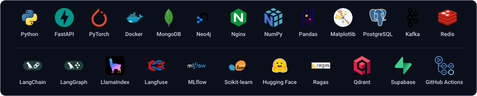

  

  
  
  

<h1 data-importer="text" align="center">hey there 👋</h1>

<h3 data-importer="text" align="left">👩‍💻  About Me</h3>

I'm a Mathematics & Informatics student at Hanoi University of Science and Technology (HUST) with a strong passion for AI/ML. I currently focus on exploring RAG, Agentic AI, and LLM applications. I love turning ideas into useful products, building practical AI solutions, and constantly learning new technologies. I'm always eager to grow, collaborate, and tackle real-world problems.

<h3 data-importer="text" align="left">🛠 Language and tools</h3>

  

<h3 data-importer="text" align="left">🔥   My Stats :</h3>

  

