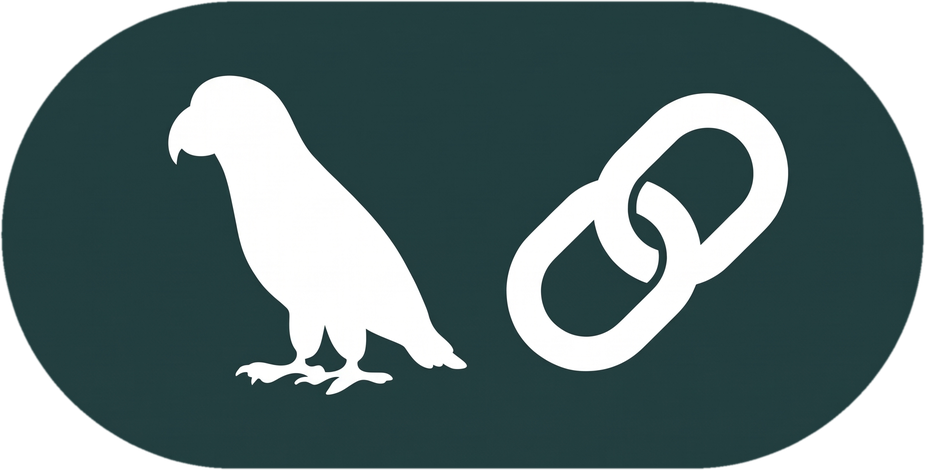
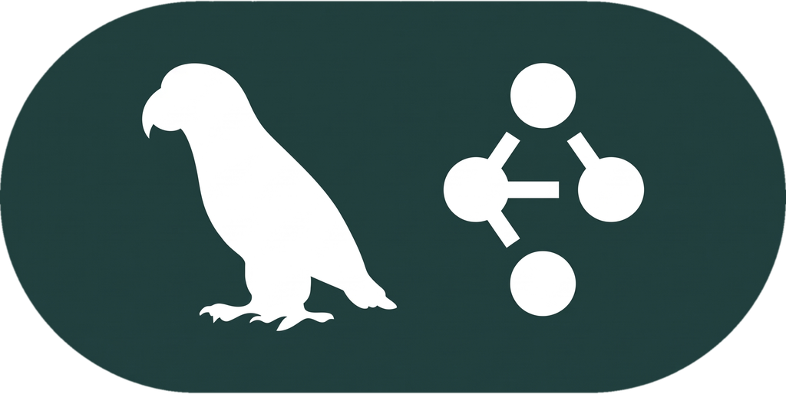
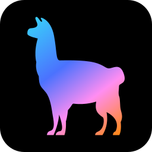
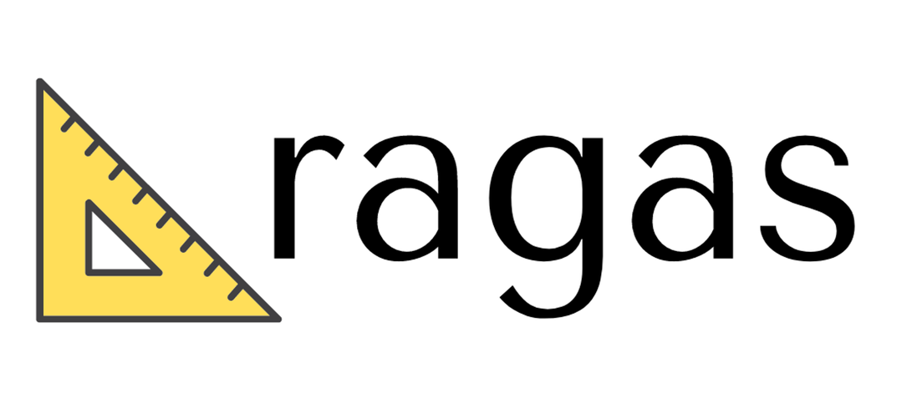
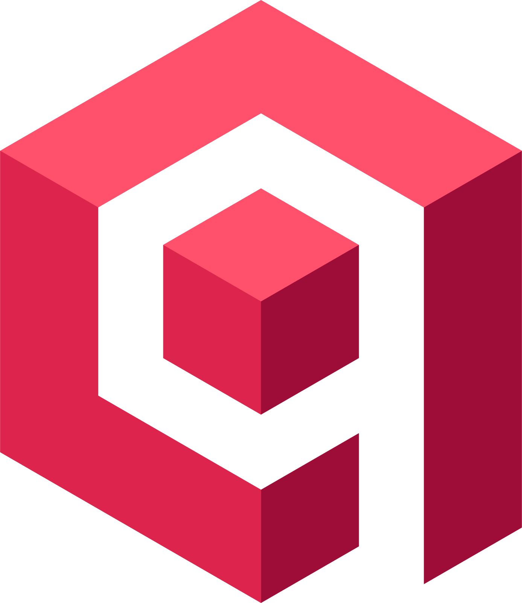

  

  
  
  

  

<h1 data-importer="text" align="center">hey there 👋</h1>

<h3 data-importer="text" align="left">👩‍💻  About Me</h3>

I'm ... from ....  - 🔭 I’m working as ... - 📚 I'm currently learning ... - ⚡ In my free time I ...

<h3 data-importer="text" align="left">🛠 Language and tools</h3>

  
  
  
  
  
  
  
  
  
  
  
  
  
  
  
  
  
  
  
  
  
  
  
  
  

 

  
  
  
  
  
  
  
  
  
  
  
  
  
  
  
  
  
  
  

<h3 data-importer="text" align="left">🔥   My Stats :</h3>

  

