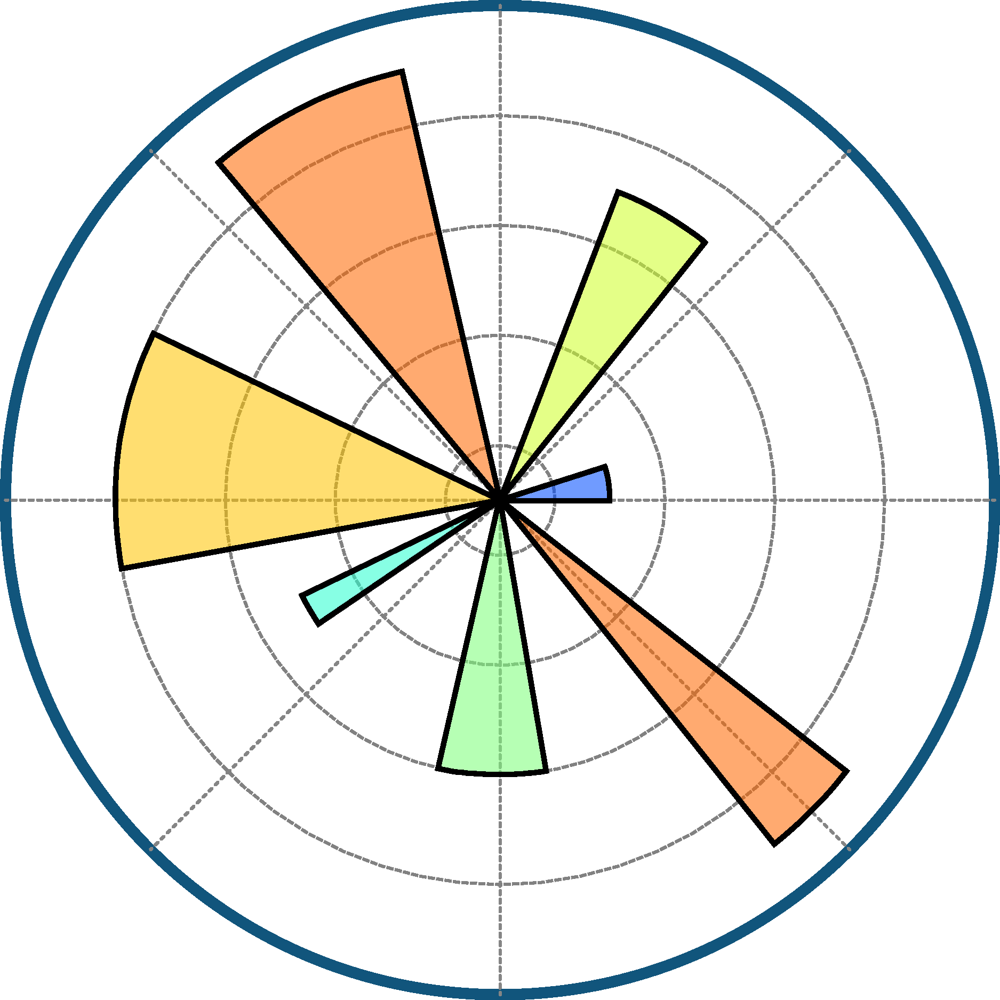

  

  
  
  

<h1 data-importer="text" align="center">hey there 👋</h1>

<h3 data-importer="text" align="left">👩‍💻  About Me</h3>

I'm a Mathematics & Informatics student at Hanoi University of Science and Technology (HUST) with a strong passion for AI/ML. I currently focus on exploring RAG, Agentic AI, and LLM applications. I love turning ideas into useful products, building practical AI solutions, and constantly learning new technologies. I'm always eager to grow, collaborate, and tackle real-world problems.

<h3 data-importer="text" align="left">🛠 Language and tools</h3>

<table align="left">
  <tr>
    <td align="center" width="70">
       
      Python
    </td>
    <td align="center" width="70">
       
      FastAPI
    </td>
    <td align="center" width="70">
       
      PyTorch
    </td>
    <td align="center" width="70">
       
      Docker
    </td>
    <td align="center" width="70">
       
      MongoDB
    </td>
    <td align="center" width="70">
       
      Neo4j
    </td>
    <td align="center" width="70">
       
      Nginx
    </td>
    <td align="center" width="70">
       
      NumPy
    </td>
    <td align="center" width="70">
       
      Pandas
    </td>
    <td align="center" width="70">
       
      Matplotlib
    </td>
    <td align="center" width="70">
       
      PostgreSQL
    </td>
    <td align="center" width="70">
       
      Pytest
    </td>
    <td align="center" width="70">
       
      Redis
    </td>
  </tr>
</table>

 

<table align="left">
  <tr>
    <td align="center" width="75">
       
      LangChain
    </td>
    <td align="center" width="75">
       
      LangGraph
    </td>
    <td align="center" width="75">
       
      LlamaIndex
    </td>
    <td align="center" width="75">
       
      Langfuse
    </td>
    <td align="center" width="75">
       
      MLflow
    </td>
    <td align="center" width="75">
       
      Scikit-learn
    </td>
    <td align="center" width="75">
       
      Hugging Face
    </td>
    <td align="center" width="75">
       
      Ragas
    </td>
    <td align="center" width="75">
       
      Qdrant
    </td>
    <td align="center" width="75">
       
      Supabase
    </td>
    <td align="center" width="75">
       
      GitHub Actions
    </td>
  </tr>
</table>

<h3 data-importer="text" align="left">🔥   My Stats :</h3>

  

